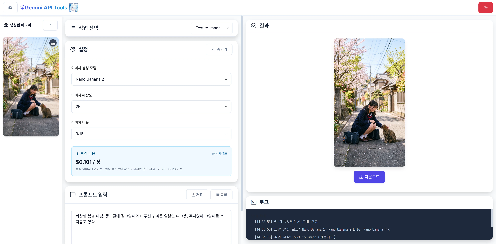

# Gemini Playground

**English** | [한국어](README.md)

A FastAPI-based web application for generating images, videos, and speech with the Google Gemini API.




## Features

### Supported Tasks
- **Text to Image**: Generate images from a text prompt
- **Image to Image**: Generate new images based on input images
- **Text to Video**: Generate videos from a text prompt
- **Image to Video**: Turn input images into a video
- **Text to Speech**: Convert text to speech (30 voice options)

### Web UI
- Responsive design (desktop and mobile)
- Drag-and-drop file upload (desktop)
- Real-time log panel
- Preview and download generated files
- Save and manage prompts
- English / Korean UI (English by default; the selection is saved in the browser)

## Installation and Running

### Running with uv (recommended)

0. If uv is not installed
```bash
pip install uv
```

1. **Create the .env file**
```env
cp .env.example .env
vi .env
```

2. **Run the web application**
```bash
uv run app.py
```

uv automatically creates the virtual environment and installs dependencies.
Once the server is up, http://localhost:33000 opens automatically in the default browser.
- To disable it, set `OPEN_BROWSER=false` in `.env`
- It is skipped automatically on Linux without a GUI display (SSH servers, systemd, etc.), and a missing browser never affects the server

3. **Access**
- Local: http://localhost:33000
- Remote: http://[server IP]:33000

## Server Deployment (Background Execution)

### Option 1: Shell scripts (Linux/Mac)

```bash
# Grant execute permission
chmod +x start_server.sh stop_server.sh

# Start the server
./start_server.sh

# Check logs
tail -f server.log

# Stop the server
./stop_server.sh
```

### Option 2: nohup directly

```bash
cd /path/to/gemini-playground
nohup uv run app.py > server.log 2>&1 &
echo $! > server.pid

# Stop the server
kill $(cat server.pid)
```

### Option 3: systemd service (recommended - Linux)

1. **Edit the service file**
```bash
# Edit the following in gemini-playground.service:
# - YOUR_USERNAME: your actual username
# - /path/to/gemini-playground: the actual path
```

2. **Install the service**
```bash
sudo cp gemini-playground.service /etc/systemd/system/
sudo systemctl daemon-reload
sudo systemctl enable gemini-playground
sudo systemctl start gemini-playground
```

3. **Manage the service**
```bash
# Check status
sudo systemctl status gemini-playground

# View logs
sudo journalctl -u gemini-playground -f

# Stop the service
sudo systemctl stop gemini-playground

# Restart the service
sudo systemctl restart gemini-playground
```

### Option 4: screen or tmux

```bash
# Using screen
screen -S gemini-playground
cd /path/to/gemini-playground
uv run app.py
# Detach with Ctrl+A, D

# Reattach
screen -r gemini-playground

# Using tmux
tmux new -s gemini-playground
cd /path/to/gemini-playground
uv run app.py
# Detach with Ctrl+B, D

# Reattach
tmux attach -t gemini-playground
```

### Windows Deployment

```cmd
# Run start_server.bat
start_server.bat
```

To register it as a Windows service, NSSM (Non-Sucking Service Manager) is recommended.

## Directory Structure

```
/
├── app.py                      # FastAPI backend
├── pyproject.toml              # uv project settings
├── requirements.txt            # Python dependencies
├── README.md                   # Documentation (Korean)
├── README.en.md                # Documentation (English)
├── .gitignore                  # Git settings
├── start_server.sh             # Server start script (Linux/Mac)
├── stop_server.sh              # Server stop script (Linux/Mac)
├── start_server.bat            # Server start script (Windows)
├── gemini-playground.service   # systemd service file
├── data.db                     # Prompt database (auto-generated, ignored by Git)
├── server.log                  # Server log (auto-generated, ignored by Git)
├── server.pid                  # Process ID (auto-generated, ignored by Git)
├── static/                     # Static files
│   ├── index.html             # Main HTML
│   ├── css/
│   │   └── style.css          # Custom CSS
│   └── js/
│       ├── i18n.js            # UI translations (English/Korean)
│       └── main.js            # Client JavaScript
├── uploads/                   # Temporary storage for uploads (auto-generated)
└── outputs/                   # Generated files (auto-generated)
```

## API Endpoints

### Tasks
- `POST /api/text-to-image` - Generate an image from text
- `POST /api/image-to-image` - Generate an image from images
- `POST /api/text-to-video` - Generate a video from text
- `POST /api/image-to-video` - Generate a video from images
- `POST /api/text-to-speech` - Generate speech from text

### Prompt Management
- `GET /api/prompts` - List prompts
- `POST /api/prompts` - Save a prompt
- `PUT /api/prompts/{id}` - Update a prompt
- `DELETE /api/prompts/{id}` - Delete a prompt

### File Download
- `/outputs/{filename}` - Download a generated file

## Usage

1. Open the application in a browser
2. Select a task type
3. Upload input files if needed (drag-and-drop or file picker)
4. Adjust settings (image aspect ratio, video resolution, voice, etc.)
5. Enter a prompt
6. Click the Run button
7. Review and download the result

### Language Setting

Use the language selector in the top-right corner of the page (or the login page) to switch between English and Korean. The default is English, and your choice is stored in the browser's `localStorage` and restored on your next visit. The same value is also stored in a `lang` cookie so that server-side error messages and the login page follow the selected language.

## Tech Stack

### Backend
- **FastAPI**: Web framework
- **Uvicorn**: ASGI server
- **google-generativeai**: Gemini API (Image to Image)
- **google-genai**: Gemini API (other tasks)
- **Pillow**: Image processing
- **SQLite**: Prompt storage

### Frontend
- **Bootstrap 5**: UI framework
- **Bootstrap Icons**: Icons
- **Vanilla JavaScript**: Client logic

## Troubleshooting

### Checking Logs

```bash
# Follow logs in real time
tail -f server.log

# View the whole log
cat server.log

# View the last 100 lines
tail -n 100 server.log
```

### Health Check

Check whether the server is running properly:
```bash
curl http://localhost:33000/health
```

Example response:
```json
{
  "status": "healthy",
  "api_key_loaded": true,
   "outputs_dir": "/path/to/gemini-playground/outputs",
  "outputs_dir_exists": true,
   "db_path": "/path/to/gemini-playground/data.db",
  "db_exists": true
}
```

### Common Issues

1. **500 Internal Server Error**
   - Check `server.log` for the detailed error message
   - Verify that the API key is loaded: `curl http://localhost:33000/health`
   - Check the environment variable: `echo $GEMINI_API_KEY`

2. **API key issues**
   ```bash
   # Check the .env file location
   ls -la ../.env
   
   # Check the .env file (key value hidden)
   cat ../.env | grep GEMINI_API_KEY
   ```

3. **Port conflict**
   ```bash
   # Find the process using port 33000
   lsof -i :33000
   netstat -tlnp | grep 33000
   ```

4. **Permission issues**
   ```bash
   # Check permissions of the uploads and outputs directories
   ls -ld uploads outputs
   
   # Grant permissions
   chmod 755 uploads outputs
   ```

5. **Remote access issues**
   - Make sure port 33000 is open in the firewall
   - Check the server IP address: `ip addr` or `ifconfig`
   - Test the connection from the client: `telnet [server IP] 33000`

### Enabling Verbose Logging

Detailed logging is enabled by default, but if you need more information:

```python
# Change the logging level at the top of app.py
logging.basicConfig(
    level=logging.DEBUG,  # change INFO -> DEBUG
    ...
)
```

## Notes

- Video generation can take a long time (several minutes to tens of minutes)
- Uploading large files may cause timeouts
- For remote access, port 33000 must be open in the firewall
- For HTTPS, use a separate reverse proxy (nginx, Caddy, etc.)
- The web app uses its own SQLite database (`data.db`)
  - Prompts are managed separately from the desktop GUI version

## Security

- Adding an authentication/authorization system is recommended for production
- Never expose the API key to the client
- Setting a file upload size limit is recommended
- Adjust the CORS settings to fit your needs

## License

MIT License
