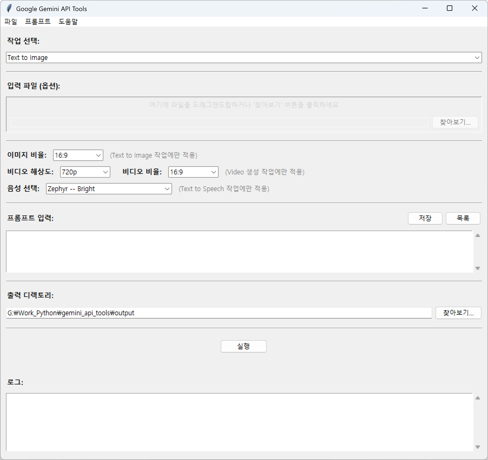
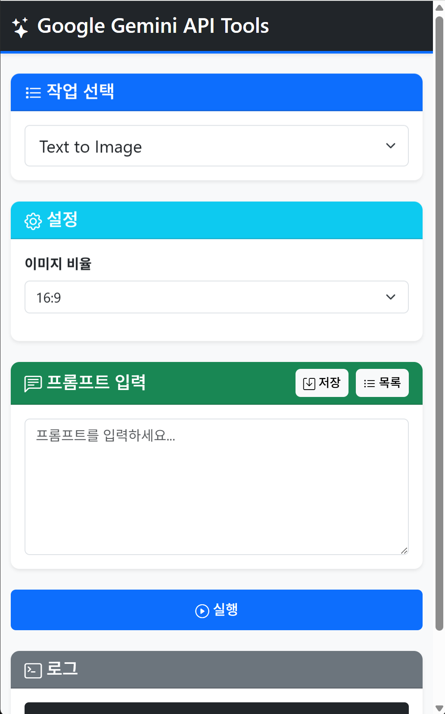

# Google Gemini API Tools

Google Gemini API를 활용한 이미지, 비디오, 음성 생성 애플리케이션

> 💡 **두 가지 버전 제공**: 데스크톱 GUI (Tkinter) 및 웹 애플리케이션 (FastAPI)

### Desktop App

### Web App


## 주요 기능

### 지원 작업
- **Text to Image**: 텍스트 프롬프트로 이미지 생성 (Gemini 2.5 Flash Image)
- **Image to Image**: 입력 이미지를 기반으로 새로운 이미지 생성
- **Text to Video**: 텍스트 프롬프트로 비디오 생성 (Veo 3.1)
- **Image to Video**: 입력 이미지를 비디오로 변환
- **Text to Speech**: 텍스트를 음성으로 변환 (Gemini 2.5 Pro TTS)

### 프롬프트 관리
- SQLite 기반 프롬프트 저장/불러오기
- 프롬프트 수정 및 삭제
- 최근 사용 순 정렬
- 프롬프트 미리보기

### UI 기능
- 드래그앤드랍을 통한 파일 입력 (tkinterdnd2 설치 시)
- 이미지 종횡비 선택 (1:1, 2:3, 3:2, 3:4, 4:3, 9:16, 16:9, 21:9)
- 비디오 해상도 선택 (720p, 1080p)
- 비디오 종횡비 선택 (16:9, 9:16)
- 음성 선택 (30가지 voice 옵션)
- 작업 완료 시 자동으로 출력 디렉토리 열기
- 실시간 로그 표시

## 버전 선택

### 데스크톱 GUI 버전 (Tkinter)
- 로컬 환경에서 사용
- 드래그앤드롭 지원 (tkinterdnd2 설치 시)
- 출력 디렉토리 자동 열기
- 실행 방법은 아래 참조

### 웹 애플리케이션 버전 (FastAPI)
- 로컬 및 원격 접속 가능
- 모던한 웹 UI (Bootstrap)
- 파일 다운로드 기능
- 백그라운드 실행 스크립트 제공 (nohup, systemd)
- 자세한 내용은 [webapp/README.md](webapp/README.md) 참조

```bash
# 웹 애플리케이션 실행 (빠른 시작 - uv 사용)
cd webapp
uv run app.py
# 접속: http://localhost:33000
```

또는 전통적인 방법:
```bash
cd webapp
pip install -r requirements.txt
python app.py
```

**서버에서 백그라운드 실행:**
```bash
cd webapp
./start_server.sh  # Linux/Mac
# 로그 확인: tail -f server.log
# 서버 중지: ./stop_server.sh
```

---

## 데스크톱 GUI 설치 및 실행

### 사전 요구사항
- Python 3.10 이상
- Google Gemini API 키

### uv를 이용한 실행 (권장)

0. uv가 설치되어 있지 않다면
```bash
pip install uv
```

1. **저장소 클론**
```bash
git clone <repository-url>
cd nanobanana
```

2. **.env 파일 생성**
```bash
cp .env.example .env
```

3. **.env 파일 편집**
```env
GEMINI_API_KEY=your_actual_api_key
```

4. **프로그램 실행**
```bash
uv run app_gui.py
```

uv가 자동으로 가상환경 생성 및 의존성 설치를 처리함.

### 전통적인 방법

```bash
# 가상환경 생성
python -m venv venv

# 가상환경 활성화 (Windows)
venv\Scripts\activate

# 가상환경 활성화 (Linux/Mac)
source venv/bin/activate

# 의존성 설치
pip install -r requirements.txt

# 프로그램 실행
python app_gui.py
```

## 환경 설정

`.env` 파일에 다음 환경 변수 설정:

```env
GEMINI_API_KEY=your_actual_api_key
```

API 키는 [Google AI Studio](https://aistudio.google.com/apikey)에서 발급 가능.

## 사용 방법

### 기본 워크플로우

1. **작업 선택**: 드롭다운에서 원하는 작업 선택
2. **입력 파일 지정** (Image to Image, Image to Video만 해당):
   - '찾아보기' 버튼 클릭
   - 또는 드래그앤드랍 영역에 파일 드롭
3. **설정 조정**:
   - 이미지 비율 (Text to Image)
   - 비디오 해상도 및 비율 (Video 작업)
   - 음성 선택 (Text to Speech)
4. **프롬프트 입력**:
   - 직접 입력
   - 또는 저장된 프롬프트 불러오기
5. **실행**: 실행 버튼 클릭
6. 작업 완료 시 출력 디렉토리 자동 열림

### 프롬프트 관리

#### 저장
- 프롬프트 입력 후 '저장' 버튼 클릭
- 또는 메뉴: 프롬프트 → 새로 저장

#### 불러오기
- '목록' 버튼 클릭
- 원하는 프롬프트 선택 후 '불러오기' 또는 더블클릭

#### 수정/삭제
- 목록에서 프롬프트 불러온 후
- 메뉴: 프롬프트 → 수정 또는 삭제

## 디렉토리 구조

```
gemini_api_tools/
├── app_gui.py              # 데스크톱 GUI 애플리케이션 (Tkinter)
├── pyproject.toml          # uv 프로젝트 설정
├── requirements.txt        # Python 의존성 (GUI 버전)
├── README.md               # 프로젝트 문서
├── screenshot.png          # 스크린샷
├── .env.example            # 환경 변수 템플릿
├── .gitignore              # Git 무시 파일 목록
├── .env                    # 환경 변수 (Git 무시, 직접 생성)
├── data.db                 # 프롬프트 데이터베이스 (자동 생성, Git 무시)
├── input/                  # 입력 파일 디렉토리 (Git 무시)
├── output/                 # 출력 파일 디렉토리 (자동 생성, Git 무시)
├── temp/                   # 임시 파일 디렉토리 (Git 무시)
├── reference/              # 참조용 예제 코드
├── webapp/                        # 웹 애플리케이션 버전 (FastAPI)
│   ├── app.py                    # FastAPI 백엔드
│   ├── pyproject.toml            # uv 프로젝트 설정 (웹 버전)
│   ├── requirements.txt          # Python 의존성 (웹 버전)
│   ├── README.md                 # 웹 버전 문서
│   ├── .gitignore                # Git 설정
│   ├── start_server.sh           # 서버 시작 스크립트 (Linux/Mac)
│   ├── stop_server.sh            # 서버 중지 스크립트 (Linux/Mac)
│   ├── start_server.bat          # 서버 시작 스크립트 (Windows)
│   ├── gemini-api-webapp.service # systemd 서비스 파일
│   ├── data.db                   # 프롬프트 데이터베이스 (웹 버전, 자동 생성, Git 무시)
│   ├── static/                   # 정적 파일
│   │   ├── index.html           # 메인 HTML
│   │   ├── css/                 # CSS 파일
│   │   └── js/                  # JavaScript 파일
│   ├── uploads/                 # 업로드 파일 (자동 생성)
│   └── outputs/                 # 출력 파일 (자동 생성)
└── .venv/                  # uv 가상환경 (자동 생성, Git 무시)
```

## 기술 스택

### 데스크톱 GUI 버전

#### 핵심 라이브러리
- **google-generativeai**: Gemini Flash Image 모델 (Image to Image)
- **google-genai**: Gemini Image, Veo Video, TTS 모델
- **pillow**: 이미지 처리
- **python-dotenv**: 환경 변수 관리
- **tkinterdnd2**: 드래그앤드랍 지원 (선택적)

#### UI
- **tkinter**: Python 표준 GUI 라이브러리
- **ttk**: 모던 테마 위젯

#### 데이터베이스
- **sqlite3**: 프롬프트 저장 (Python 표준 라이브러리)

### 웹 애플리케이션 버전

#### 백엔드
- **FastAPI**: 웹 프레임워크
- **Uvicorn**: ASGI 서버
- **google-generativeai** & **google-genai**: Gemini API
- **Pillow**: 이미지 처리
- **SQLite**: 프롬프트 저장

#### 프론트엔드
- **Bootstrap 5**: UI 프레임워크
- **Bootstrap Icons**: 아이콘
- **Vanilla JavaScript**: 클라이언트 로직

## 설정 옵션

### 이미지 생성 (Text to Image)
- 종횡비: 1:1, 2:3, 3:2, 3:4, 4:3, 9:16, 16:9, 21:9
- 기본값: 16:9

### 비디오 생성 (Text to Video, Image to Video)
- 해상도: 720p, 1080p
- 종횡비: 16:9 (가로), 9:16 (세로)
- 기본값: 720p, 16:9

### 음성 생성 (Text to Speech)
- 음성 선택: 30가지 옵션 제공
  - Zephyr (Bright), Puck (Upbeat), Charon (Informative), Kore (Firm), Fenrir (Excitable)
  - Leda (Youthful), Orus (Firm), Aoede (Breezy), Callirrhoe (Easy-going), Autonoe (Bright)
  - Enceladus (Breathy), Iapetus (Clear), Umbriel (Easy-going), Algieba (Smooth), Despina (Smooth)
  - Erinome (Clear), Algenib (Gravelly), Rasalgethi (Informative), Laomedeia (Upbeat), Achernar (Soft)
  - Alnilam (Firm), Schedar (Even), Gacrux (Mature), Pulcherrima (Forward), Achird (Friendly)
  - Zubenelgenubi (Casual), Vindemiatrix (Gentle), Sadachbia (Lively), Sadaltager (Knowledgeable), Sulafat (Warm)
- 기본값: Zephyr (Bright)

## 출력 파일

### 데스크톱 GUI 버전
모든 생성된 파일은 `output/` 디렉토리에 타임스탬프 기반 파일명으로 저장됨:

- 이미지: `output_YYYYMMDD-HHMMSS.png`
- 비디오: `output_YYYYMMDD-HHMMSS.mp4`
- 음성: `output_YYYYMMDD-HHMMSS.wav`

### 웹 애플리케이션 버전
생성된 파일은 `webapp/outputs/` 디렉토리에 저장되며, 브라우저에서 다운로드 가능

## 데이터베이스

- **데스크톱 GUI 버전**: `data.db` (프로젝트 루트)
- **웹 애플리케이션 버전**: `webapp/data.db` (webapp 디렉토리)
- 각 버전의 프롬프트는 독립적으로 관리됩니다

## 제한사항

- 비디오 생성은 시간이 오래 걸릴 수 있음 (수 분 ~ 수십 분)
- API 사용량에 따른 할당량 제한 존재
- 1080p 비디오는 720p보다 생성 시간이 더 소요됨
- tkinterdnd2 미설치 시 드래그앤드랍 기능 비활성화 (파일 선택 다이얼로그는 정상 작동)

## 라이선스

MIT License

## 참고 자료

- [Google AI Studio](https://aistudio.google.com/)
- [Gemini API Documentation](https://ai.google.dev/gemini-api/docs)
- [uv Documentation](https://docs.astral.sh/uv/)

